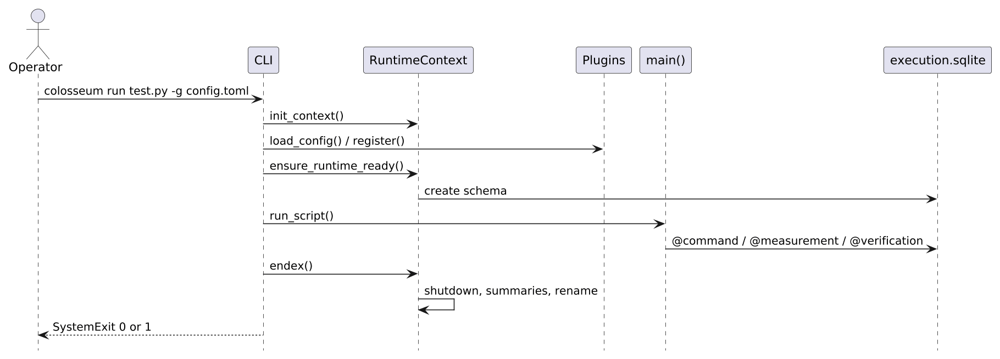
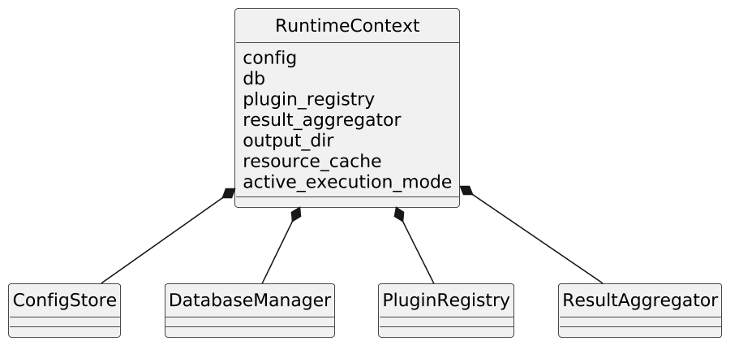
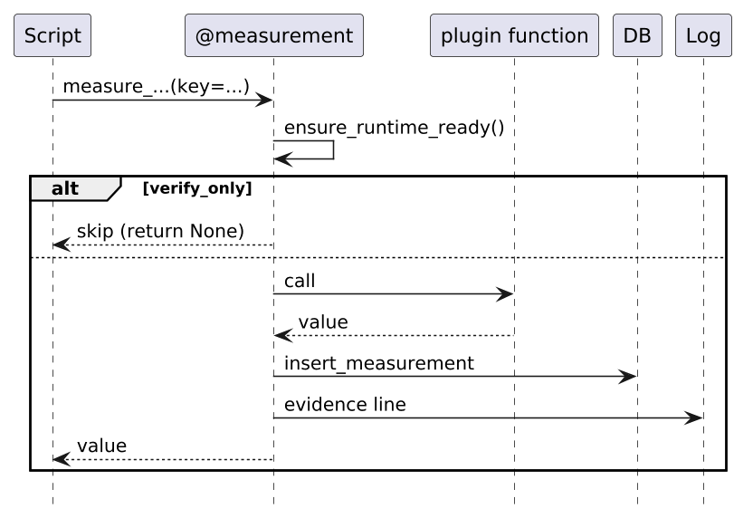
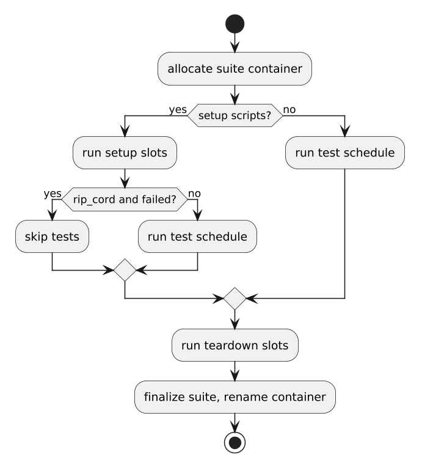

.. _runtime-execution:

Runtime execution
=================

A **standard run** is one process, one :term:`RuntimeContext`, one timestamped
output folder, and a ``main()`` that issues decorated plugin calls. Core never
talks to instruments. It records :term:`evidence`, aggregates outcomes, and
exits 0 or 1.

The canonical command is::

   colosseum run my_test.py -g config.toml

Direct ``python my_test.py`` and ``colosseum run-suite`` share the same evidence
machinery with a different bootstrap. Operator-facing CLI flags are in
:doc:`running_tests` and :doc:`running_suites`. This chapter is the runtime
spine: context, plugins, decorators, SQLite, finalize, and exit policy.

Process entry
-------------

``colosseum`` is a console script into ``colosseum.runner.cli:main``. The CLI
parses arguments, builds ``RunOptions`` (input/output dirs,
:term:`execution mode`, optional ``-c`` commands), then runs a single test
or a suite.

A test script is a module with ``main()``. The CLI does **not** execute the
script's ``if __name__ == "__main__"`` block. It loads the file with ``runpy``
under the name ``colosseum.test_run`` and calls ``main()`` only.
``col.endex()`` in the script is optional for CLI; the runner always
finalizes. See :doc:`writing_test_scripts`.

Typical ``main()``: load config when running under plain Python, then a
sequence of ``col.<namespace>.*`` commands, measurements, and verifications
tied together by an :term:`evidence key`.

   Single-run sequence: CLI initializes context, loads plugins, runs
   ``main()``, then ``endex()``.

Context: the process singleton
------------------------------

Before any work, the CLI calls ``init_context``. That builds a
:term:`RuntimeContext` and stores it as the process-wide active context.
Everything later - decorators, plugins, the database, summaries - reads
``get_context()``.

.. list-table::
   :header-rows: 1
   :widths: 28 72

   * - Field
     - Role
   * - ``plugin_registry``
     - Discovered plugins, namespaces, config specs, shutdown hooks
   * - ``config``
     - Loaded TOML (:term:`ConfigStore`)
   * - ``db``
     - SQLite evidence (``execution.sqlite`` or in-memory)
   * - ``result_aggregator``
     - Required/optional PASS/FAIL/ERROR to exit code
   * - ``output_dir``
     - Timestamped run folder (unset until bootstrap)
   * - ``resource_cache``
     - Plugin-owned live objects (connections, sessions)
   * - ``active_execution_mode``
     - ``full``, ``procedure``, or ``verify_only``
   * - ``run_options``
     - CLI ``-i`` / ``-o`` / ``-p`` / ``-u``

CLI sets ``auto_finalize=False``. Direct ``python script.py`` that calls
``load_config`` sets ``auto_finalize=True`` and registers ``atexit`` /
``excepthook`` so a forgotten :term:`endex` still writes :term:`artifacts`.

   ``RuntimeContext`` collaborators.

Config and plugin discovery
---------------------------

``load_config`` applies TOML to the existing context (CLI already created one).
``apply_raw_config`` then:

1. **Discovers plugins** via setuptools entry points ``colosseum.plugins``.
   Each plugin's ``register(registry)`` runs once.
2. **Registers** a :term:`namespace` (``col.template``, ``col.<name>``, ...),
   optional :term:`ConfigSectionSpec` rows (dotted TOML path plus integer id
   field), and optional shutdown hooks.
3. **Normalizes TOML**: each registered section becomes ``{id: row}``.
   Duplicate ids or missing required keys are ``ConfigError`` (process exits 1,
   no run folder).
4. Stores the :term:`ConfigStore` on the context.

After this, ``col.template.measure_widget_count`` works because
``import colosseum as col`` uses ``__getattr__`` to resolve a lazy namespace
proxy from the registry. Plugins also load on first ``col.<namespace>.*``
access if you skipped ``-g``, and when invoking ``-c`` commands.

Authoring a plugin is :doc:`plugins`. This chapter only covers how a run
loads whatever is already installed.

Runtime bootstrap
-----------------

``ensure_runtime_ready`` runs **before** ``main()`` on the CLI path. It is also
called from every decorator, so a direct-Python script that only
``load_config``\ s still bootstraps on the first ``@command`` /
``@measurement`` / ``@verification``.

With artifacts on (the default):

1. Allocate ``cwd/outputs/<YYYY-MM-DD_HHMMSS>_<script_stem>/`` (or the
   ``-o`` root). No ``-pass`` / ``-fail`` suffix yet.
2. Attach the ``colosseum`` logger: INFO (or DEBUG with ``-d``) to stdout,
   DEBUG to ``debug.log``.
3. Print the run header: version, Python, platform, test name, config path,
   output dir.
4. Create ``execution.sqlite`` with tables ``run_metadata``,
   ``measurements``, ``verifications``, ``commands``, ``events``.
5. Stamp ``test_case_name``, ``suite_name``, ``config_path``.
6. Log which config sections and ids loaded.

``--no-artifacts`` skips the folder and file log; SQLite is in-memory. See
:doc:`running_tests`.

``main()``: the evidence loop
-----------------------------

This is the actual test. Core does not interpret procedure logic. The script
calls plugin functions; decorators wrap every call.

Three decorator kinds, same pattern:

1. Ensure context and runtime ready.
2. Maybe skip (:term:`execution mode`).
3. Call the real function.
4. Write a SQLite row.
5. Feed :term:`ResultAggregator` (commands and verifications only).
6. Log.

.. list-table::
   :header-rows: 1
   :widths: 22 78

   * - Decorator
     - Role
   * - ``@command``
     - Stimulus or setup. Success is a ``commands`` row with ``status=PASS``.
       Returning ``CommandResult`` lets the plugin set FAIL/ERROR. An exception
       becomes ERROR: recorded, then re-raised unless ``optional=True``.
       Required command ERROR fails the run.
   * - ``@measurement``
     - Capture a value under ``(domain, command, key)``. :term:`domain` comes
       from the plugin package (``__colosseum_domain__``). Command id is derived
       from the API module path. ``key=`` is the operator-facing
       :term:`evidence key` that verifications look up. Duplicate keys are an
       error unless ``multi_row=True``. The return value is JSON-serialized.
       Exceptions become ``status=ERROR`` and re-raise.
   * - ``@verification``
     - Pass/fail against a prior measurement (usually the same ``key=``). The
       plugin body typically looks up the measurement and returns
       ``VerificationResult`` or a ``bool``. Missing ``key=`` or a thrown
       exception is ERROR, not a crash of the wrapper. ``optional=True``
       records FAIL/ERROR but does not change the exit code.

See :doc:`measurements_verifications` for script-author rules and
:doc:`exit_codes` for the single-bit policy.

   One decorated measurement call. Command and verification wrappers follow
   the same shape.

Execution modes gate the wrappers:

.. list-table::
   :header-rows: 1

   * - Mode
     - Flag
     - Commands
     - Measurements
     - Verifications
   * - ``full``
     - default
     - run
     - run
     - run
   * - ``procedure``
     - ``-p``
     - run
     - run
     - skipped (no rows)
   * - ``verify_only``
     - ``-u <prior run>``
     - skipped
     - skipped
     - run against imported rows

``-u`` copies ``measurements`` and ``commands`` from the prior
``execution.sqlite`` and sets ``imported_from`` in metadata, then re-runs only
verifications.

CLI ``-c namespace.function,key=val`` is the same ``@command`` path without a
script: parse the spec, resolve the registered namespace, invoke, then
finalize.

While ``main()`` runs, plugins may stash live handles in
:term:`resource cache`. Core does not know the types; at shutdown it calls
``.close()`` on anything that has it, and plugins may also register explicit
``close_all`` hooks.

If ``main()`` raises or ``sys.exit``\ s before the runner's ``endex()``, the
script runner wraps that as ``ScriptRunError``, the CLI marks a suite error
(``"test script failed"``), and ``finally: endex()`` still finalizes.

Finalize: ``endex()``
---------------------

For a single run, :term:`endex` is process-terminating: it scores the
aggregator, writes artifacts, and raises ``SystemExit`` with 0 or 1.

``finalize_run(mode="single", run_shutdown=True)`` then:

1. **Score** via ``ResultAggregator.exit_code()``:

   - required FAIL or ERROR fails the run
   - optional FAIL/ERROR is ignored for the exit code
   - uncaught script error (``mark_suite_error``) fails the run

2. Write ``overall_status`` and ``exit_code`` into SQLite, flush, close the
   database.
3. Run plugin shutdown hooks, then ``resource_cache`` ``.close()``.
4. Log ``Overall result: PASS|FAIL (exit 0|1)`` and close log handlers
   (releases ``debug.log``).
5. **Rename** the folder: ``..._my_test`` becomes ``..._my_test-pass`` or
   ``..._my_test-fail``.
6. Write artifacts into the renamed directory: ``summary.txt``,
   ``summary.json``, and ``wats_<UTC>_<script>.json`` (identity fields from
   ``--metadata`` YAML when given).

Exit is only 0 or 1. Optional verification failures stay 0. A required
verification against a missing measurement is ERROR and exits 1. See
:doc:`exit_codes` and :doc:`output_artifacts`.

What a finished run looks like
------------------------------

::

   outputs/2026-08-30_190512_my_test-pass/
     debug.log
     execution.sqlite
     summary.txt
     summary.json
     wats_20260830T230512_my_test.json

SQLite is the source of truth: every command, measurement, verification, and
runner event (``script_start``, ``script_done``, errors). Summaries and
:term:`WATS` are projections of that plus the aggregator.

Suite variant
-------------

``colosseum run-suite suite.toml`` uses the same decorators and per-script
``main()``, with a container around :term:`slot` folders.

1. Parse suite TOML: ``name``, ``setup[]``, ``tests[]`` (optional
   ``repeat_count`` / ``repeat_for``), ``between_tests[]``, ``teardown[]``,
   ``fail_fast``, ``rip_cord``.
2. Allocate a :term:`suite container` directory; console logging only at this
   level.
3. For each script, ``begin_script_slot``: new aggregator, new SQLite, nested
   folder under the container.
4. Run ``main()``. ``endex()`` inside a suite **does not exit the process** -
   it finalizes that slot and returns.
5. **Test** slots affect the suite result and get full artifacts (summary plus
   WATS). Setup, between, and teardown do not; they get ``debug.log`` and
   ``execution.sqlite`` only.
6. ``rip_cord=true``: a failing supporting or test slot skips remaining tests
   but still runs teardown, and the suite fails.
7. ``fail_fast=true``: after a failing **test** slot, skip remaining tests.
8. After all slots: ``finalize_suite`` - plugin shutdown once, write container
   summaries, rename the container ``-pass`` / ``-fail``. Suite exit is 0 iff
   every test slot passed.

See :doc:`running_suites` for TOML shape and operator flags.

   Suite slot schedule.

Direct Python
-------------

``python my_test.py`` is the same evidence path with a different bootstrap:

1. ``load_config`` creates the context (``auto_finalize=True``) if none exists.
2. The first decorator (or ``endex()``) calls ``ensure_runtime_ready``.
3. ``main()`` then ``col.endex()``. If ``endex()`` is omitted, the atexit hook
   still finalizes.

CLI always finalizes in ``finally``, even when the script has no ``endex()``.

End-to-end picture
------------------

::

   colosseum run my_test.py -g bench.toml
           |
           v
     init_context (process singleton)
           |
           v
     load_config --> colosseum.plugins entry points
           |
           v
     ensure_runtime_ready
        outputs/<stamp>_my_test/   debug.log   execution.sqlite
           |
           v
     runpy --> main()
        col.template.arm_device(...)              @command
        col.template.measure_widget_count(key=)   @measurement
        col.template.verify_widget_count(key=)    @verification
        + ResultAggregator
           |
           v
     endex() --> score --> shutdown --> rename -pass/-fail
              --> summaries --> SystemExit(0|1)

Core's job is that vertical spine. Instrument I/O, transports, and host checks
live in plugins behind ``col.<namespace>.*``.
